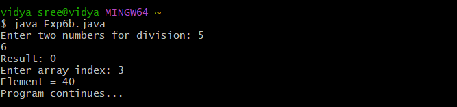

# java-lab-cse-g-5ef-6b
# EXPERIMENT-6B
## MultiCatchClauses 
source code 
```
import java.util.*;

public class Exp6b {
    public static void main(String[] args) {
        Scanner sc = new Scanner(System.in);
        int[] arr = {10, 20, 30, 40, 50};
        try {
            System.out.print("Enter two numbers for division: ");
            System.out.println("Result: " + (sc.nextInt() / sc.nextInt()));

            System.out.print("Enter array index: ");
            System.out.println("Element = " + arr[sc.nextInt()]);
        } catch (ArithmeticException e) { System.out.println("Error: Division by zero.");
        } catch (InputMismatchException e) { System.out.println("Error: Use numeric values.");
        } catch (ArrayIndexOutOfBoundsException e) { System.out.println("Error: Invalid index.");
        } finally { System.out.println("Program continues..."); }
    }
}


```
# OUTPUT: 

